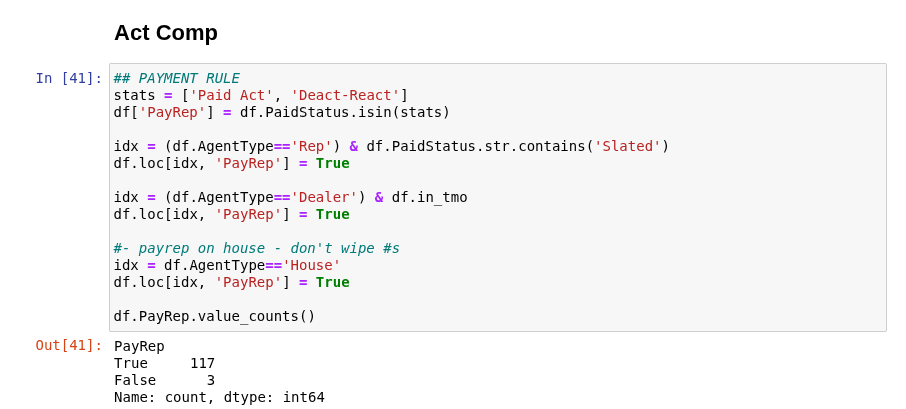

# Commissions Processing System
A Python-based data processing system for accomplishing all tasks related to commissions: calculating KPI, reconciling revenue, and calculating sales commissions for sellers.

This repository hosts selections from that code.  No customer, sales, or revenue information is included.

**Technology Stack: Python, pandas, Jupyter Notebooks**

# The Business Problem

My company needed a custom code system for processing commissions.  The company was a business-to-business vendor for wireless lines and services.  The business received commissions from wireless based on sales, and paid out commissions to sellers.  There was no database, no data engineering support, and no reliable way to reconcile what we were paid against internal records. Identifying missing or underpaid commissions required significant manual effort and was prone to error.

The commissions tasks posed challenges of complexity and scale, which only grew over time: 45 sales agents, 8 incoming data sources, multiple agent types, multiple commission types, individual commission plans with multiple components and exceptions by customer, and exhaustive auditing needs across thousands of payment records every month.

## Input Data
Many data sources are necessary for the specified outputs:

**Home-business data**
* Activation Log
* Activation Records for IOT

**Carrier data**
* Activation Commission Statement
* IOT Commission Statement
* Residual Statement
* Activation Detail
* Activation Summary
* Total Commission Summary


## Commission Tasks & Deliverables
The system generates:

* KPI for generated and received revenue.
* Commission calculation reports for sales representatives.
* Discrepancy reports highlighting missing or underpaid commissions.
* Structured datasets for downstream analysis.

# The System

I built a modularized code system using Python-pandas that simulates core database behaviors: ingestion, transformation, and structured output.  

**Design Principles**

* **Modularity** - Functions and components of processing were separated out into clear, distinct modules.

* **Efficiency** - Designed for as little code redundancy as possible, again using modules to provide reusable code.  Vectorized functions were utilized whenver possible.

* **Coherence** - All processing of data was done with a central logic and data flow for consistent results.

The architecture is organized into three tiers.

1. **Core Modules** - Basic utility functions used throughout the system.
1. **Data Preparation Modules** - Dedicated processing functions and preloading for each data input.
1. **Task-Oriented Python Notebooks** - All direct tasks are performed in notebooks, for clarity and quick review.


### Tier 1 - Core Modules

The core modules defined general data utility functions shared across the entire codebase.  Core modules also defined filepaths, date variables, and parameters for the code run.  These functions and variables supported data processing at the next tier and top-level tasks.

*Example: cleaning delimiters*

```python
def dropDelimiters(s):
    """
    Removes delimiters from a pandas Series.
    """
    delims = '\'",./|;'
    for delim in delims:
        s = s.str.replace(delim, '')
    return s
```

### Tier 2 - Data Preparation Modules

Each input was preprocessed through a dedicated module.  This preparation included standardizing columns, formatting data, preparatory calculations, and merging with early resources.  The result was a consistent, readable, intermediate dataset - an effective "silver layer."

When data prep modules are initialized, they automatically load and preprocess the data.  Thus loading these modules at the start of each work sessions automatically loads all processed data into memory for immediate use.

```python
def processWI(wi0):
    """Process WI data into standardized format."""
    
    wi = wi0.copy()
    wi = applyKey(wi, keyFolder + 'wiKey.xlsx')

    # column standardization
    wi.Customer = processNames(wi.Customer)
    wi.BAN = wi.BAN.str.replace(' ', '')

    # date normalization
    wi.Date = wi.Date.fillna(wi.ActDate)
    wi['Month'] = wi.Date.astype(str).str[:7]

    # ... additional transformations (device typing, router flags, MRC calculations).

    # final cleanup 
    wi = wi.sort_values(by=['Customer', 'Month'])
    wi['in_wi'] = True

    return wi

#%% Preload
fp = filepaths.loc['wi'].Filepaths[-1]
wi0 = readFile(fp, dt)
wi = processWI(wi0)
wi.shape
```

### Tier 3 – Task-Level Notebooks

Top-level Jupyter notebooks act as the execution layer.  Each task receives a dedicated notebook - or in the case of full commissions processing, a notebook series.  Top-level notebooks load all modules from the lower tiers so that all processed data and utility functions are at hand at the start of each task, and notebooks can focus only on unique and pertinent operations.

Notebooks enabled frequent checks on calculations.  Most cells would output summaries of new attributions or calculations.  Even simply calling `df.shape` could provide a bit of assurance that the last operation completed correctly.

**Example - Slating orders for payment in Commissions Calculations Notebook**



## The Column Key System
To handle inconsistent and changing schemas, I introduced a **column key abstraction**.

A *column key* is an external configuration (stored in Excel) that defines the preprocessing transformation - column inclusion, order, and renaming.

This system was used in system **Tier 2** for producing the effective "silver layer" of dataframes.  It was a key component in having the data clear and usable at the start of every session.

**Example Column Key Excel File**


...

**Core Function** 

```python
def applyKey(df, keyPath, create=True):
    """
    Reads and applies a column key.
    
    Parameters:
        df (DataFrame): Input data
        keyPath (str): Path to column key file
        create (bool): Whether to create missing columns
    """
    # Load key as series with orignal names as index.
    k = pd.read_excel(keyPath, index_col='Old').New
    # Drop blank rows.
    k = k[k.index.notnull()]
    
    # -- Handle missing columns, omitted. --
    # ...
        
    # Slice and order columns.
    df = df[k.keys()].copy()
    # Rename columns - only where new names exist.
    df = df.rename(columns=k.dropna())
    
    return df
```

## Other system features
**Precalculation and Data Inferences**
Preparing data inputs meant performing early calculations that would be useful in any context.  Basic features such as device types and quantity counts were useful to determine early, and then summarizing data downstream was trivial.

For example: A quantity column is useful, showing whether the business was credited a line, charged back on a line, or whether the entry had no net change.  It was useful to describe this mathematically as a quantity of 1, -1, or 0.  This determination could only be made from the incoming commission itself, as line activity was an unreliable feature.
```python
    #- Qty: +1, -1, 0 from Incoming commission
    tmobile['Qty'] = (tmobile.Incoming / (tmobile.Incoming.abs()+0.0001)).round()
```

**Balance Carryover** 
Sales agents can incur chargebacks resulting in a net-negative commission balance.  The system needed to calculate, store, and attribute these balances correctly and in accordance with business rules.  The system uses a balance ledger that shows the history of seller balances, and contributes that information to the current month of commission calculations.  Balance calculations had previously been a manual task subject to human error and forgetfulness.  With the balance carryover system, all balances were correctly handled without additional human input.

**Residual Attribution**
Some sales agents earned residuals on wireless lines, which paid for years after initial activation.  Correctly attributing those lines and crediting the sellers was necessary to uphold the commissions contract.  A simple spreadsheet list of Business Account Numbers / "BANs" attributed to each seller was created as a record - serving as system "memory."  Attributing sellers to their residuals was performed in the preprocessing step for the residual statement.


**Calculation Checks**
Even with a sound code base, errors can occur due to changes in incoming data, new business rules, custom adjustments, or code enhancements and updates.  The system and commission process involves checks throughout the process that validate results.  Checks include:

1. Comparison of final calculations against ballpark projections from the unmerged activation logs.
1. Comparisons of expected payment percentages against targets.
1. Random samples of calculations.
1. Rundowns of data by key categories that can signal mismatches - such as rates of unpaid lines or unattributed orders. 

A dedicated notebook produces rundowns of data by key categories.


# Summary
My commission code system automated the variety of tasks related to commissions, based on a variety of input data sources.  The key to its success was a centralized, modularized, tiered code base.  The entire code base was loaded at the start of every task, creating a consistent set of functions and clear, usable versions of all data inputs (an effective "silver layer").  In this way, enterprise-level performance was accomplished entirely in a custom code system.
